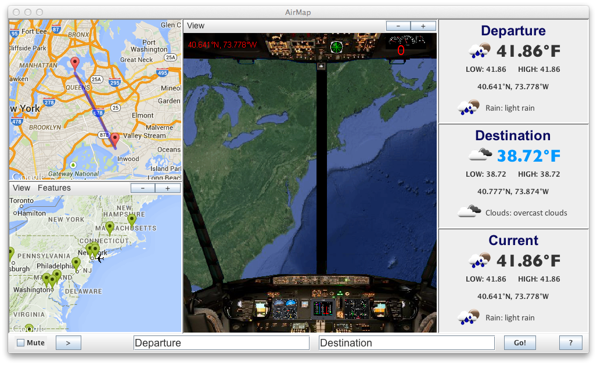

# AirMap
AirMap is a Java Swing based multi-threaded interactive flight simulator.  
This program uses GoogleMaps API to plot flight paths and render display maps as the simulation runs.  
JSON files are used to retrieve current weather conditions for real time updated GUI displays. 

Instructions
----
1. Press the play button to begin flying.  
You may pause and resume the game any time during the flight.
2. Enter the name of your departure and destination sites (this can be an address or any airport name).  
Then press go!
3. Navigate the plane from the departure site to your destination.
4. The plane's initial speed is set to 0. Like any plane, it will not start flying until the speed is increased.  
The only thing that will move at speed 0 are the animated control dials!  
Use the top control panel to keep track of the current speed and lat/log.
5. The plane will automatically land if you reach within range of the destination.
6. After landing, you can either enter a new destination, or just fly and explore.

Note: If you enter a new departure site and destination mid flight, the plane will relocate to the beginning of the new route.

*Warning: Aliens have invaded the north and south pole. Any trespassers will be zapped!!*

Controls
----
* Use the four arrow keys <kbd>&#8592;</kbd> <kbd>&#8593;</kbd> <kbd>&#8595;</kbd> <kbd>&#8594;</kbd> to control the plane direction (or numbers/number pad)
* Use <kbd>-</kbd> and <kbd>+</kbd> keys to increase and decrease the plane speed
* The check box toogles the air controller audio mute option

Additional Features
----
* 20 different zoom levels (-/+ buttons)
* View drop down menu that allow map customization (such as a choice of satellite, roadmap, hybrid and terrain map types)
* Access to the menu features through memonomics
* Look for tooltips if you ever get stuck, or just click on the ? button.

Upcoming in AirMap 2.0
----
* Street View option
* Enabling the Features Menu to allow further map customization
* Airport names on markers
* Ablitity to choose destination by clicking on an airport marker
* Watch the weather (snow/rain) come alive on actual map!
* Plane crashing notification

Downloading
----
A runable .jar file is available for download [here](AirMap.jar).

To download or clone a complete copy of the source code, use Git or checkout with SVN using https://github.com/tziporaziegler/AirMap.git web URL.

About
----
Project collaborated by Shifra (Glazer) Black and Tzipora Ziegler.
